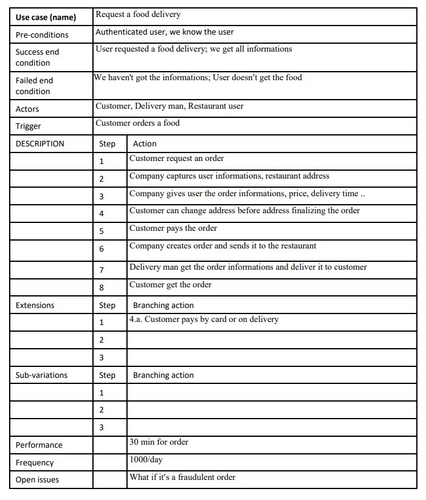
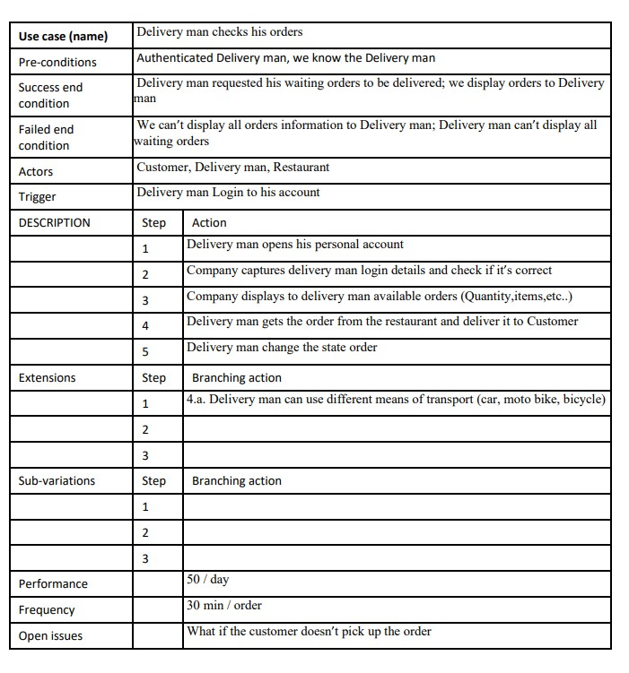
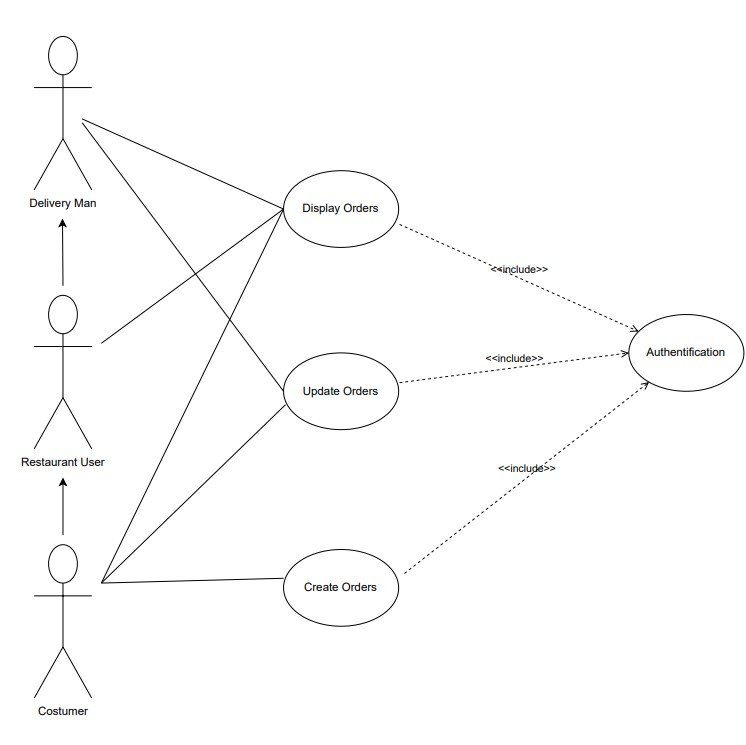
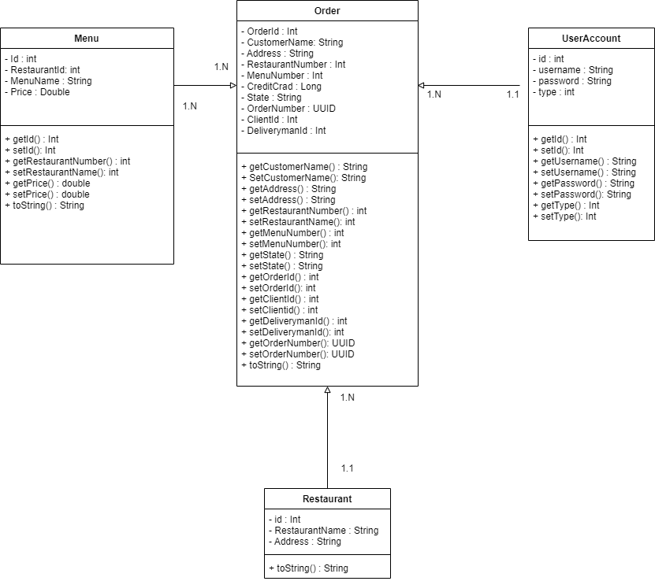
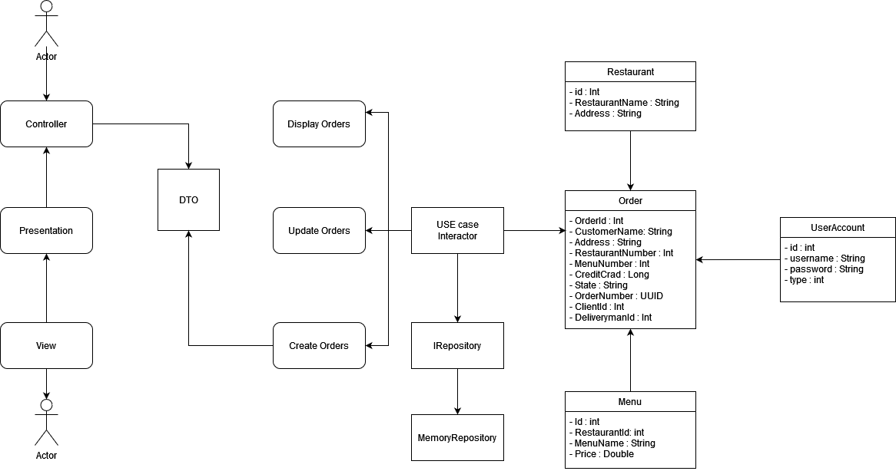

# DeliveryApp

## USE CASES

- USE CASE 1 : Customer place order ; check all his orders history details
- USE CASE 2 : Delivery man can display all orders with these states (Awaiting delivery, Delivered )
also can update order state (status) from **Awaiting delivery** to **Delivered**.
## LOGIN

- Customer login : username : customer | password : customerpass
- delivery man login : username deliveryman | password : deliverymanpass
## SERVICES

- 1. **CreditCardValidator :** This service is based on **Luhn algorithm**, using this **Algorithm** we can check and identify if the Credit Card numbers are valid or not.
because user may use random 16 numbers to pass this step.
 * Here is some Credit Card numbers to test this service.
 * **MasterCard :** 5105105105105100
 * **Visa :** 	4012888888881881
- 2. **Authentication :** This service is used to check if user login is correct or not.
- 3. **MemoryRepository :** This service is used to save, display data. 

## How to RUN

- You can use the executable .bat file  named **RUN_DeliveryAPP** located in the **racine**
- You can use the jar file named **app-1.0.jar** located in **\app\target**

## USE CASES

## USE CASE DIAGRAM

## CLASS DIAGRAM

## CLEAN ARCHITECTURE PACKAGE

